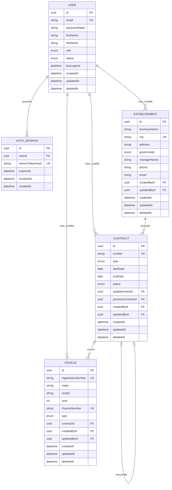
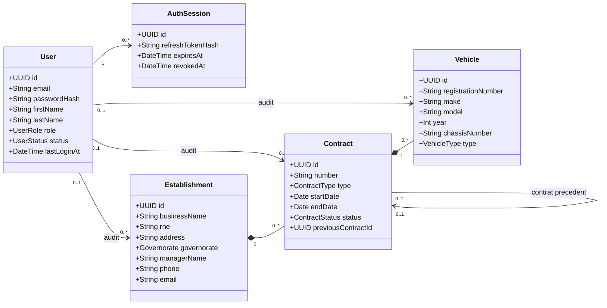

# BH Assurance - Conception de la base de donnees

## 1. Perimetre

Cette conception couvre uniquement la persistance des donnees de la plateforme :

- utilisateurs et sessions d'authentification ;
- etablissements assures ;
- contrats et renouvellements ;
- vehicules rattaches aux contrats.

Le dashboard ne possede pas de table dediee. Ses indicateurs seront calcules depuis
les tables transactionnelles afin d'eviter les donnees dupliquees ou incoherentes.

## 2. Choix structurants

- Les cles primaires sont des UUID, adaptes aux API et non predictibles.
- Les dates metier utilisent le type PostgreSQL `date`.
- Les dates techniques utilisent `timestamptz`.
- Les montants, s'ils sont ajoutes plus tard, utiliseront `Decimal` et jamais
  `Float`.
- `RNE`, numero de contrat, immatriculation et numero de chassis sont uniques.
- Les valeurs saisies pour les identifiants uniques doivent etre normalisees par
  l'application avant ecriture : espaces retires, casse uniforme et email en
  minuscules.
- Les entites metier utilisent une suppression logique via `deletedAt`.
- Un renouvellement cree un nouveau contrat. Le nouveau contrat reference le
  contrat precedent avec `previousContractId`; l'ancien contrat reste consultable.
- Le statut d'un contrat est stocke pour les workflows. Le service metier devra
  synchroniser ce statut avec les dates dans une transaction.
- Les mots de passe et refresh tokens ne sont jamais stockes en clair.

## 3. MCD



## 4. Diagramme UML



## 5. Relations et cardinalites

| Source | Relation | Cible | Regle de suppression |
|---|---:|---|---|
| User | 1 - N | AuthSession | Cascade physique des sessions |
| Establishment | 1 - N | Contract | Suppression physique interdite |
| Contract | 1 - N | Vehicle | Suppression physique interdite |
| Contract | 0..1 - 0..1 | Contract precedent | Reference mise a `NULL` |
| User | 0..1 - N | Entites auditees | Reference mise a `NULL` |

`Restrict` protege les donnees d'assurance contre une suppression accidentelle.
La suppression fonctionnelle positionnera `deletedAt` dans une transaction.

## 6. Regles d'integrite

Les contraintes suivantes seront appliquees dans la base ou dans la couche metier :

1. `startDate` doit etre strictement anterieure a `endDate`.
2. L'annee d'un vehicule doit etre comprise entre 1900 et l'annee courante + 1.
3. Un contrat renouvele doit concerner le meme etablissement que son precedent.
4. Un contrat ne peut renouveler qu'un seul contrat precedent, et un contrat ne
   peut avoir qu'un seul successeur.
5. Les roles autorises sont `ADMIN`, `MANAGER` et `VIEWER`.
6. Un utilisateur `VIEWER` ne peut effectuer aucune mutation.
7. Une session expiree ou revoquee ne peut pas emettre de nouveau jeton JWT.
8. Un contrat ou etablissement supprime logiquement n'accepte plus de nouveaux
   rattachements.

Prisma ne permet pas d'exprimer les contraintes `CHECK`. Elles devront etre
ajoutees dans la migration SQL initiale :

```sql
ALTER TABLE "contracts"
  ADD CONSTRAINT "contracts_dates_check"
  CHECK ("start_date" < "end_date");

ALTER TABLE "vehicles"
  ADD CONSTRAINT "vehicles_year_check"
  CHECK ("year" BETWEEN 1900 AND EXTRACT(YEAR FROM CURRENT_DATE)::int + 1);
```

## 7. Indexation

- Index de recherche sur raison sociale et nom du responsable.
- Index de filtrage sur gouvernorat.
- Index composites des contrats par etablissement/statut et par statut/date de fin.
- Index composite des vehicules par contrat/marque/modele.
- Index des sessions par utilisateur et expiration.
- Index `deletedAt` pour les requetes excluant les lignes archivees.

Pour une recherche tolerante aux accents et aux fautes, une migration ulterieure
pourra activer `pg_trgm` et ajouter des index GIN, apres validation du besoin et
du volume reel.

## 8. Source executable

Le schema Prisma complet se trouve dans `prisma/schema.prisma`. La migration
initiale devra etre generee lors de l'etape backend, puis completee par les deux
contraintes SQL ci-dessus avant son application.

